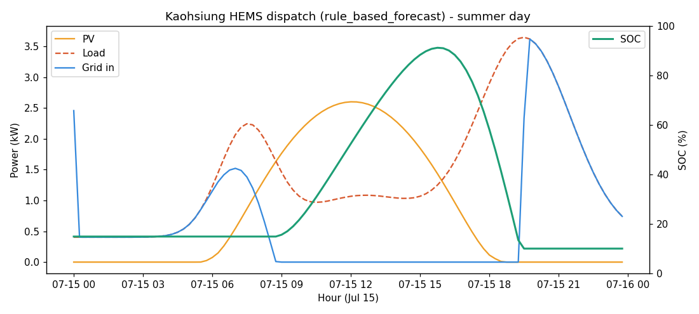

# 台灣家庭能源管理系統模擬器（Taiwan HEMS Simulator）

[](https://github.com/dincht55/taiwan-HEMS-simulator/actions/workflows/ci.yml)


模擬「太陽能板 + 電池 + 市電」在台電分時電價下的能源調度，估算節電與經濟效益。
以 pvlib 計算在地日照、規則式/MILP 策略逐時調度，並輸出自用率、自給率、年電費與回本年限。
預設地點為高雄市前鎮區，可用內建的設定精靈一鍵切換到任何地區。

> 📍 **適用範圍：以台灣為主。** 太陽能與電池等物理引擎為通用設計（任一座標皆可），
> 但**電價制度為台灣（台電）專屬**——尖離峰時段、夏月、週末全離峰、二段/三段式邊界與
> 累進級距寫在 `power_dispatch.py`。費率「數值」可在 `config.ini` 調整；若要套用其他國家，
> 需自行修改 `power_dispatch.py` 的時段與級距表。

> ⚠️ 台電費率、躉購費率與設備單價會逐年調整；本專案內建數值僅為**參考值**。
> 結果為**決策參考、非投資建議**，正式評估請向台電/能源署確認當期數字並做現勘。

## 功能特色
- 在地化太陽能：pvlib 晴空模型 + 氣候平年值縮放（多雲/溫度降額）；無 pvlib 時自動退回簡化模型。
- 三種控制策略：純規則式自用優先、預測式（查明日天氣配置夜充）、MILP 最佳化基準。
- 餘電去向可切換：自用限發 / 自發自用餘電躉售（賣台電）。
- 多種分析模式：單次模擬、策略比較、容量掃描、電費比較、餘電躉售對照、面積分階段設計、大型因子實驗。
- 效能：numba JIT 調度核心（全年 35040 步毫秒級）+ multiprocessing 多核掃描。
- 單一設定來源 `config.ini`；附 67 項 pytest。

## 安裝
需 Python 3.10+。
```bash
pip install -r requirements.txt
```

## 快速開始
```bash
# （選用）用設定精靈依地區自動查座標與氣候，寫回 config.ini
python setup_config.py

# 依 config.ini 執行單次全年模擬，輸出 CSV+圖、印指標
python main.py --mode single
```

## 設定精靈（連網）
`setup_config.py` 會：輸入地區 → 線上查詢座標/海拔/時區（Open-Meteo 地理編碼）與逐月氣候
（歷史平均氣溫與日照）→ 寫回 `config.ini` 的 `[location]`，並把氣候平年值存到
`data/climate_normals.csv`（`solar_pv` 會自動採用，取代內建高雄預設）。僅用標準庫、免 API 金鑰。
> 氣候為歷史統計平均（非預報）；最高精度請改用官方 TMY 或實測逐時輻照。

## 執行模式（`config.ini` 的 `[run] MODE`，或 `--mode` 覆寫）
| 模式 | 說明 |
|------|------|
| `single`    | 單次全年模擬，輸出 CSV+圖、印指標 |
| `compare`   | 同配置比較三種控制策略 |
| `sweep`     | PV×電池容量網格掃描（多核） |
| `tariff`    | 比較三種電費方案（一般/二段/三段） |
| `feedin`    | 餘電躉售對照（不加電池）：不躉售 vs 餘電躉售 vs PV+電池自用 |
| `area`      | 無電池餘電躉售系統，依可安裝面積分階段配置元件與最佳設計 |
| `factorial` | 大型因子實驗：電費×負載×PV×電池×策略 全組合（多核） |

```bash
python main.py --mode sweep
python main.py --ini my.ini --mode factorial
```

## 高雄市模擬結果範例

以下為**高雄市前鎮區**（預設座標）的模擬輸出，皆可用對應指令重現。

**共同假設**：合成住宅負載（high，年約 11,476 kWh／月約 950 度，傍晚型）；三段式電價；
PV 單位發電約 1,419 kWh/kWp/年（pvlib + 高雄氣候平年值）；策略 `rule_based_forecast`。
> ⚠️ 數字對負載形狀、費率級距、設備單價皆敏感，且為合成負載下的特定配置結果；
> 為**決策參考、非投資建議**。費率/單價會逐年調整，請以台電/能源署當期公告為準。

### 1) 單次模擬（PV 5 kWp + 電池 10 kWh，三段式）— `--mode single`
| 指標 | 值 |
|------|-----|
| 年發電 / 年負載 | 7,094 / 11,476 kWh |
| 自用率 SCR / 自給率 SSR | 86.5% / 52.2% |
| 年電費（PV+電池） | 19,925 元 |
| 全系統年省（vs 無系統） | 24,854 元 → 回本 ≈ 17.3 年 |
| 電池淨增益（扣衰減） | 4,794 元 → 電池回本 ≈ 37.5 年 |

### 2) 控制策略比較（同 5 kWp + 10 kWh）— `--mode compare`
| 策略 | SCR | SSR | 年電費 | 全系統回本 | 電池回本 |
|------|----:|----:|-------:|-----------:|---------:|
| rule_based | 86.5% | 51.5% | 20,316 | 17.6 年 | 38.7 年 |
| rule_based_forecast | 86.5% | 52.2% | 19,925 | 17.3 年 | 37.5 年 |
| milp_mpc | 85.0% | 51.7% | 20,241 | 17.5 年 | 38.6 年 |

> 預測式（查明日天氣配置夜充）略優於純規則式；MILP 為最佳化基準對照。

### 3) 電費方案比較（同 5 kWp + 10 kWh）— `--mode tariff`
| 電費方案 | 年電費 | 全系統年省 | 全系統回本 |
|----------|-------:|-----------:|-----------:|
| 一般式（累進） | 13,785 | 31,567 | 13.6 年 |
| 二段式 | 22,044 | 32,614 | 13.2 年 |
| 三段式 | 19,925 | 24,854 | 17.3 年 |

> 此配置下一般式帳單最低；時間電價要在「高用量 + 能大量移轉到離峰」時才划算。

### 4) 容量掃描（PV × 電池，回本最短排序）— `--mode sweep`
| PV | 電池 | SSR | 全系統年省 | 全系統回本 |
|----|------|----:|-----------:|-----------:|
| 1 kWp | 0 | 12.4% | 4,806 | **10.4 年（最短）** |
| 2 kWp | 0 | 22.8% | 8,982 | 11.1 年 |
| 3 kWp | 0 | 28.3% | 11,174 | 13.4 年 |
| 5 kWp | 10 kWh | 52.2% | 24,854 | 17.3 年 |
| 8 kWp | 0 | 37.3% | 14,852 | 26.9 年 |
| 1 kWp | 15 kWh | 21.5% | 9,914 | 32.3 年（最長） |

> 回本最短一律落在「無電池」配置；加電池拉高自給率，但拉長回本。

### 5) 餘電去向三方對照（不裝電池，FiT 5.6279 元/度）— `--mode feedin`
無系統年電費基準 = 44,779 元。
| PV | 餘電 kWh | A 不躉售(限發) 電費／回本 | B 餘電躉售 電費／回本 | C PV+電池10kWh 電費／回本 |
|----|---------:|:---:|:---:|:---:|
| 1 kWp | 0 | 39,972 ／ 10.4 年 | 39,972 ／ 10.4 年 | 36,567 ／ 28.0 年 |
| 3 kWp | 1,005 | 33,605 ／ 13.4 年 | 27,951 ／ 8.9 年 | 26,336 ／ 17.9 年 |
| 5 kWp | 3,266 | 31,557 ／ 18.9 年 | 13,178 ／ 7.9 年 | 19,925 ／ 17.3 年 |
| 8 kWp | 7,069 | 29,927 ／ 26.9 年 | −9,859 ／ 7.3 年 | 18,076 ／ 21.7 年 |

> 能餘電躉售時，PV 越大回本越短（B）；花錢買電池自用（C）反而拉長回本——電池宜當備援。

### 6) 無電池餘電躉售・依面積分階段設計 — `--mode area`
| 可裝面積 | PV | 片數 | 逆變器 | 系統成本 | 年發電 | 自用率 | 餘電 | 躉售收入 | 年淨效益 | 回本 | 20年淨現金 |
|---------|----|----:|-------|--------:|------:|------:|----:|--------:|--------:|----:|----------:|
| 10 ㎡ | 1.35 kWp | 3 | 1.4 kW | 94,500 | 1,915 | 99.8% | 4 | 21 | 6,499 | 14.5 年 | 35,480 |
| 20 ㎡ | 3.15 kWp | 7 | 3.1 kW | 195,300 | 4,469 | 74.2% | 1,155 | 6,502 | 17,892 | 10.9 年 | 162,531 |
| 30 ㎡ | 4.50 kWp | 10 | 4.5 kW | 252,000 | 6,385 | 58.2% | 2,666 | 15,005 | 27,833 | 9.1 年 | 304,653 |
| 40 ㎡ | 6.30 kWp | 14 | 6.3 kW | 315,000 | 8,939 | 45.4% | 4,880 | 27,462 | 41,515 | 7.6 年 | 515,301 |
| 50 ㎡ | 7.65 kWp | 17 | 7.7 kW | 382,500 | 10,854 | 39.1% | 6,613 | 37,219 | 51,926 | 7.4 年 | 656,017 |
| 65 ㎡ | 9.90 kWp | 22 | 9.9 kW | 495,000 | 14,047 | 31.8% | 9,584 | 53,940 | 69,442 | 7.1 年 | 893,839 |

> 餘電躉售下「把屋頂填滿」最划算（回本 14.5 → 7.1 年）；惟 ≥10 kWp 會跌出最高 FiT 級距。

## 輸出圖表與欄位說明

執行 `--mode single` 會在 `output/` 產生一張「代表夏日」的逐時調度圖與一份全年 CSV。



**怎麼看這張圖**（以高雄夏日、PV 5 kWp + 電池 10 kWh 為例）：
- 橫軸：一天 24 小時（00:00–24:00）。
- 左縱軸（kW，功率）：
  - **PV（橙線）**：太陽能發電，正午最高、夜間為 0。
  - **Load（紅虛線）**：家庭負載，呈早晚雙峰（傍晚最高）。
  - **Grid in（藍線）**：向台電購電功率；白天太陽能足夠時趨近 0，夜間或清晨補電池時拉高。
- 右縱軸（%）：**SOC（綠線）**：電池剩餘電量百分比。典型走勢為白天用餘電充電（SOC 上升）、
  傍晚尖峰放電供負載（SOC 下降）。

**指標欄位**（模擬摘要與結果表）：
| 欄位 | 意義 |
|------|------|
| SCR（自用率） | 被自家用掉的太陽能 ÷ 太陽能總發電 |
| SSR（自給率） | 自家供應的負載 ÷ 總負載 = (總負載 − 購電) ÷ 總負載 |
| 年電費 | 全年購電成本 − 售電收入 + 基本電費 |
| 全系統回本 | 系統建置淨成本 ÷ (相對「無系統」的年省) |
| 電池(淨)回本 | 電池成本 ÷ (電池相對「純 PV」多省的錢 − 衰減成本) |

**全年 CSV 欄位**（逐時，索引為時間戳）：`pv_kw`(發電)、`load_kw`(負載)、`price`(購電單價)、
`soc`(電池剩餘%)、`batt_ch_kw`/`batt_dis_kw`(充/放電)、`grid_in_kw`/`grid_out_kw`(購電/饋網)、
`pv_to_load_kw`/`pv_to_batt_kw`/`grid_to_batt_kw`(太陽能與市電流向)、`pv_curtail_kw`(限發)。
每時步皆滿足功率平衡：`pv + grid_in + batt_dis = load + grid_out + batt_ch + curtail`。

## 單一設定來源
所有可調數值集中於 **`config.ini`**，由 `config.py` 讀成唯讀的 `AppConfig`。改參數不必動程式碼。
其中售電相關兩個鍵：
- `TARIFF_SELL_PRICE`：本次模擬「實際」售電價（自用型未登記躉售＝0）。
- `TARIFF_FEED_IN_PRICE`：躉購(FiT)參考價，供 `feedin`/`area` 模式評估「若登記躉售」。

實測逐時用電可放 `data/load_profile.csv`（單欄 kW），比合成負載更準。

## 專案結構
```
config.ini            單一設定來源
config.py             讀 config.ini → AppConfig
setup_config.py       設定精靈（連網查座標/氣候）
electrical_base.py    模組1：單位換算、效率、功率平衡
solar_pv.py           模組2：pvlib 太陽能（可載入在地氣候）
battery_charge.py     模組3：SOC 動態、充放電
power_dispatch.py     模組4：計價、規則式調度、累進電價、MILP 輔助
fast_core.py          numba JIT 調度核心
hems_simulation.py    模組5：整合、策略、指標、掃描、因子實驗
main.py               進入點：讀 config.ini → 依模式執行
docs/                 設計知識檔（架構/電學/電池/電價/策略/結論）
tests/test_hems.py    pytest（模組 1–5）
data/                 climate_normals.csv（精靈產生）、load_profile.csv（實測，選用）
```

## 測試
```bash
pytest -q
```

## 專有名詞說明

| 名詞 | 說明 |
|------|------|
| **kWp** | 太陽能裝置容量（峰瓩）；標準測試條件下的額定發電功率。 |
| **kW / kWh** | 功率（瞬時）／能量（功率×時間）。本專案功率欄位皆為該時步平均功率。 |
| **SCR 自用率** | 太陽能被自家用掉的比例；越高代表發的電越少被浪費/外送。 |
| **SSR 自給率** | 家庭用電由自家（太陽能+電池）供應的比例；越高越不依賴市電。 |
| **SOC** | 電池剩餘電量百分比（State of Charge），受上下限（如 10%~95%）保護。 |
| **時間電價** | 依時段定價（尖峰最貴、離峰最便宜），如二段式、三段式。 |
| **累進電價（一般式）** | 不分時段、依當月用電度數分段累進；全台多數住宅採用。 |
| **尖峰／半尖峰／離峰** | 三段式時段；夏月平日尖峰最貴（如 16–22 時），離峰最便宜。 |
| **躉購費率（FiT）** | Feed-in Tariff，台電/能源署保證收購再生能源電力的單價，簽約鎖 20 年。 |
| **自發自用餘電躉售** | 太陽能先自用、餘電以 FiT 賣給台電（需登記、裝雙向電表）。 |
| **限發（curtailment）** | 餘電無法自用又不外送時被丟棄（台灣自用型常見）。 |
| **削峰填谷／尖峰套利** | 離峰充電、尖峰放電，賺取尖離峰價差（須採時間電價才有空間）。 |
| **往返效率** | 充電效率×放電效率；電能「存進再取出」的整體效率（鋰電約 90–95%）。 |
| **衰減成本** | 電池每吞吐 1 度電的磨損成本（元/kWh），納入最佳化避免高估效益。 |
| **全系統回本** | 整套（PV+電池）建置淨成本 ÷ 年省電費。 |
| **電池回本** | 電池額外成本 ÷ 電池相對「純 PV」多省的錢（扣衰減）。 |
| **LCOS** | 均化儲能成本：每搬一度電的真實成本（含設備攤提，元/kWh）。 |
| **NPV / IRR** | 淨現值／內部報酬率；考慮時間價值的投資評估（本專案回本為靜態值）。 |
| **MILP / MPC** | 混合整數線性規劃／模型預測控制；以最佳化求整段電費最低的進階策略。 |
| **規則式（rule_based）** | 自用優先決策階梯，免預測、運算輕、最穩健。 |
| **預測式（rule_based_forecast）** | 查明日天氣預報配置夜間充電與尖峰保留的規則式。 |
| **耦合架構（DC/AC）** | 電池接在直流匯流排（DC，少一次轉換）或交流側（AC，多乘逆變器效率）。 |
| **pvlib** | 開源太陽能模型函式庫，用於太陽位置與輻照計算。 |
| **單位發電（specific yield）** | 每 kWp 的年發電量（kWh/kWp/年）；高雄典型約 1,250–1,450。 |
| **TMY** | 典型氣象年（Typical Meteorological Year），長期氣候彙整的代表年資料。 |
| **基本電費** | 時間電價方案每月固定收取的費用（一般式免基本費）。 |

## 授權
MIT License，詳見 [LICENSE](LICENSE)。

## 致謝與資料來源
- 太陽位置與輻照：[pvlib](https://pvlib-python.readthedocs.io/)
- 座標與歷史氣候：[Open-Meteo](https://open-meteo.com/)（免費、免金鑰）
- 電價與躉購費率：台灣電力公司、經濟部能源署（請以官網當期公告為準）
